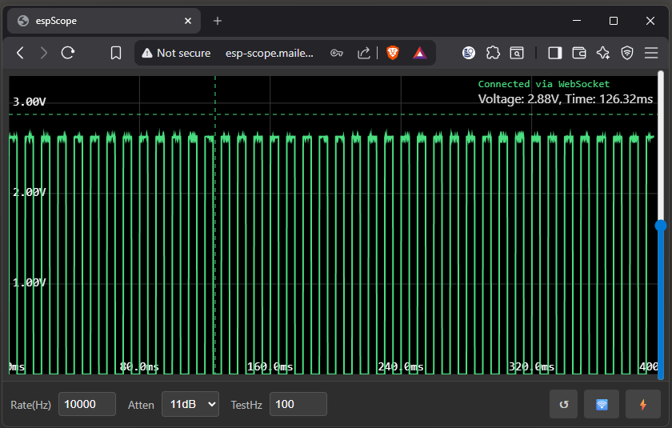

# ESP-Scope

## Overview
ESP-Scope is a web-based oscilloscope built using the ESP-IDF framework. It allows users to visualize analog signals in real-time through a web browser. The project leverages the ESP32's ADC capabilities and serves a web interface for signal visualization.



## Features
- Real-time signal visualization on a web browser.
- Adjustable sample rate (10-100000 Hz), bit width, and attenuation.
- Crosshair functionality for precise measurements.
- Adjustable trigger level.
- Reset functionality to clear settings and reload the interface.

## Getting Started

### Prerequisites
- ESP32 development board.
- [ESP-IDF](https://github.com/espressif/esp-idf) installed and configured.
- USB cable to connect the ESP32 to your computer.
- A web browser (e.g., Chrome, Firefox).

### Downloading the Project
1. Clone the repository:
   ```bash
   git clone https://github.com/MatAtBread/esp-scope.git
   ```
2. Navigate to the project directory:
   ```bash
   cd esp-scope
   ```

### Building and Flashing

If you have the esp-idf VSCode extension, just click on the flame to build, flash & monitor. Use the config settings for "espScope" to set youur WiFi SSID & password.

1. Set up the ESP-IDF environment:
   ```bash
   . $IDF_PATH/export.sh
   ```
2. Configure the project:
   ```bash
   idf.py menuconfig
   ```
3. Build the project:
   ```bash
   idf.py build
   ```
4. Flash the firmware to the ESP32:
   ```bash
   idf.py -p [PORT] flash
   ```
   Replace `[PORT]` with the serial port of your ESP32 (e.g., `/dev/ttyUSB0` or `COM3`).
5. Monitor the serial output:
   ```bash
   idf.py monitor
   ```

### Accessing the Web Interface

If your DHCP server supports it, the app sets its hostname and yu can just navigate to http://espscope (you may have/need a default domain extension)

1. After flashing, the ESP32 will display its IP address in the serial monitor.
2. Open a web browser and navigate to the displayed IP address (e.g., `http://192.168.4.1`).
3. Use the web interface to:
   - Adjust settings like sample rate, bit width, and attenuation.
   - Visualize signals in real-time.
   - Reset the interface using the "Reset" button.

### Attaching hardware

The displayed signal is sampled from ADC0. The test signal is output on D1.

## License
This project is licensed under the MIT License. See the LICENSE file for details.

## Acknowledgments
- Built using the ESP-IDF framework by Espressif Systems.
- Inspired by the need for affordable and accessible signal visualization tools.